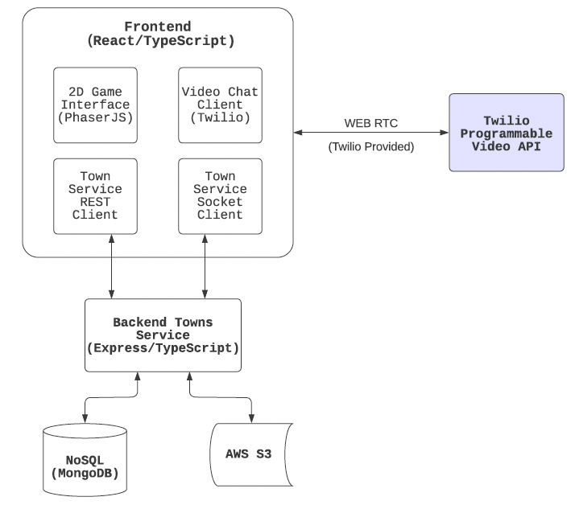

# Covey.Town

Covey.Town provides a virtual meeting space where different groups of people can have simultaneous video calls, allowing participants to drift between different conversations, just like in real life.

The figure above depicts the high-level architecture of Covey.Town.
The frontend client (in the `frontend` directory of this repository) uses the [PhaserJS Game Library](https://phaser.io) to create a 2D game interface, using tilemaps and sprites.
The frontend implements video chat using the [Twilio Programmable Video](https://www.twilio.com/docs/video) API, and that aspect of the interface relies heavily on [Twilio's React Starter App](https://github.com/twilio/twilio-video-app-react). Twilio's React Starter App is packaged and reused under the Apache License, 2.0.

A backend service (in the `services/townService` directory) implements the application logic: tracking which "towns" are available for a user to join, and the state of each of those towns. The user and town's data is stored in the `MongoDB` database. Users can register and sign in to the application to access the town service. Users can find the towns they created previously, and manage and update profile information such as password and email. Users can also upload profile images that will be stored in `AWS S3 bucket`. 

## Running this app locally

Running the application locally entails running both the backend service and a frontend.

### Setting up the backend

To run the backend, you will need a Twilio account. Twilio provides new accounts with $15 of credit, which is more than enough to get started.
To create an account and configure your local environment:

1. Go to [Twilio](https://www.twilio.com/) and create an account. You do not need to provide a credit card to create a trial account.
2. Create an API key and secret (select "API Keys" on the left under "Settings")
3. Create a `.env` file in the `services/townService` directory, setting the values as follows:

| Config Value            | Description                               |
| ----------------------- | ----------------------------------------- |
| `TWILIO_ACCOUNT_SID`    | Visible on your twilio account dashboard. |
| `TWILIO_API_KEY_SID`    | The SID of the new API key you created.   |
| `TWILIO_API_KEY_SECRET` | The secret for the API key you created.   |
| `TWILIO_API_AUTH_TOKEN` | Visible on your twilio account dashboard. |
| `MONGO_URL`             | MongoDB connection string                 |
| `JWT_SECRET`            | JWT secret key                                 |
| `BUCKET`                | AWS S3 bucket name                        |
| `AWS_BUCKET_REGION `    | AWS S3 bucket region, e.g., us-west-1     |
| `AWS_ACCESS_KEY `       | Access key of IAM user who has access to the S3 bucket |
| `AWS_SECRET_KEY`        | Secret key of IAM user who has access to the S3 bucket |

### Starting the backend

Once your backend is configured, you can start it by running `npm start` in the `services/townService` directory (the first time you run it, you will also need to run `npm install`).
The backend will automatically restart if you change any of the files in the `services/townService/src` directory.

### Configuring the frontend

Create a `.env` file in the `frontend` directory, with the line: `REACT_APP_TOWNS_SERVICE_URL=http://localhost:8081` (if you deploy the towns service to another location, put that location here instead)

Also include the line: `REACT_APP_AWS_SERVICE_URL=<Base URL of the AWS S3 bucket>` (Make sure to have the AWS S3 bucket and IAM user access key ready)  

### Running the frontend

In the `frontend` directory, run `npm start` (again, you'll need to run `npm install` the very first time). After several moments (or minutes, depending on the speed of your machine), a browser will open with the frontend running locally.
The frontend will automatically re-compile and reload in your browser if you change any files in the `frontend/src` directory.
